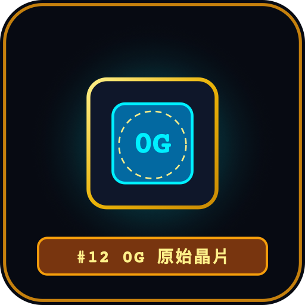

# IdleColl — 0G Deep Space Collector (星際放置收集與鏈上 AI 拍賣行)

<p align="center">
  <strong>繁體中文</strong> | <a href="README.zh-CN.md">简体中文</a>
</p>

<p align="center">
  
</p>

<p align="center">
  <strong>0G Hackathon 參賽作品</strong><br>
  結合 <b>0G Compute (去中心化 AI 推理)</b>、<b>0G Storage (去中心化 Metadata 存證)</b> 與 <b>0G Galileo Testnet (智能合約確權與去中心化結算)</b> 的 Mobile-First Web3 星際放置收集與拍賣手遊。
</p>

<p align="center">
  <a href="https://idlecoll.yayayayaya.xyz" target="_blank">
    
  </a>
  <a href="https://idlecoll.yayayayaya.xyz/presentation.html" target="_blank">
    
  </a>
  <a href="https://chainscan-galileo.0g.ai" target="_blank">
    
  </a>
</p>

<p align="center">
  <a href="https://idlecoll.yayayayaya.xyz" target="_blank">
    <br>
    <b>📱 手機掃碼立即遊玩 (Scan QR Code to Play)</b><br>
    <sub>🔗 <a href="https://idlecoll.yayayayaya.xyz">https://idlecoll.yayayayaya.xyz</a></sub>
  </a>
</p>

---

## 🎮 玩家遊玩前置指南 (Prerequisites & Guide)

為了獲得最流暢的星際冒險與拍賣行交易體驗，請先確認以下前置準備：

### 1. 建議遊玩環境（二選一最佳）
* **💻 電腦端 (PC / Mac) [最強烈推薦]**：
  * 使用 Chrome / Brave / Edge 等主流瀏覽器，並安裝 **[MetaMask 瀏覽器外掛 (Extension)](https://metamask.io/)**。
  * 點擊遊戲右上角「連線錢包」，外掛將自動彈出並引導自動新增與切換至 **0G Galileo Testnet**。
* **📱 手機端 (iOS / Android) [行動端最佳解]**：
  * 請開啟 **MetaMask 手機 App** ➔ 點擊底部導航欄的 **「瀏覽器」圖示** ➔ 在網址列輸入線上體驗網址：`https://idlecoll.yayayayaya.xyz`。
  * ⚠️ *注意：請務必在 MetaMask 內建瀏覽器中開啟，可享有「零跳轉、簽署彈窗即時浮現、100% 交易成功率」的原生手遊體驗！*

### 2. ⚠️ 錢包連線環境與 SDK 限制說明 (為何不使用外部 SDK)
* **為何不支援手機外部瀏覽器第三方 SDK（如 MetaMask SDK / WalletConnect / QR Code 掃碼）？**
  * **自定義 EVM 鏈相容性限制**：0G Galileo 測試網（Chain ID: `16602`）屬於自定義 EVM 網路。在手機外部瀏覽器（Safari 或 Mobile Chrome）使用第三方 SDK 時，受限於手機作業系統嚴格的背景機制與跨 App 切換（Deep Link），極易發生 **RPC 握手逾時、網路自動切換失效、交易簽名廣播中斷** 等不可抗力的交易卡死問題。
  * **全面回歸原生 Web3 Provider (EIP-1193 / EIP-3326)**：為保障玩家資產安全與交易流暢度，本專案不採用外部第三方 SDK，全面使用標準原生 Provider 協定：
    * **💻 電腦端**：限定使用 **MetaMask 瀏覽器外掛**。
    * **📱 手機端**：限定使用 **MetaMask App 內建瀏覽器** 原生沙盒環境操作。
    * *(若於手機外部瀏覽器點擊連線，系統會自動透過 Deep Link 喚醒並導航至 MetaMask App 內開啟)*。

### 3. 領取 0G Galileo 官方測試幣 (Faucet)
* **深空抽卡與放置採礦**：完全**由伺服器代付 Gas（玩家完全免費、零彈窗）**。
* **拍賣行掛售與購買藏品**：拍賣行智能合約皆在 0G 鏈上以 **0G 原生代幣** 進行買賣結算與合約授權。
* **免費領幣步驟**：
  1. 前往 **[0G 官方水龍頭 (Faucet)](https://faucet.0g.ai/)**。
  2. 貼上您的錢包地址並完成驗證。
  3. 點擊領取，每日可免費獲得 **0.1 0G** 測試代幣（足夠進行數十次拍賣行掛售、購買與授權操作！）。

### 4. 0G Galileo 網路參數 (若錢包未自動切換可手動填入)
* **網路名稱**：`0G Galileo Testnet`
* **RPC URL**：`https://0g-galileo-testnet.drpc.org` 或 `https://evmrpc-testnet.0g.ai`
* **Chain ID**：`16602` (`0x40da`)
* **貨幣符號**：`0G`
* **區塊瀏覽器**：`https://chainscan-galileo.0g.ai`

---

## 🌟 遊戲核心特色與重大突破

IdleColl 徹底重構了傳統鏈遊「數值枯燥」與「NFT 僅為靜態圖片」的弊病，打造出一個全流程與 0G 技術深度耦合的去中心化星際冒險世界：

### 1. 🧬 0G Compute 去中心化 AI 遺物解算引擎
* **真實去中心化 AI 推理**：接入 0G Compute Network，部署大語言模型 `qwen/qwen2.5-omni-7b` 擔任「深空星際考古學家」。
* **絕不重複的原創靈魂**：每當探測任務完成，AI Agent 依據原型與稀有度即時解算專屬稱號（如「「星際巨獸之眼」戴森球能量碎塊」）、繁體中文星際歷史由來與奇異現象傳奇故事（`aiLore`）。
* **四大實體屬性結構化輸出**：動態賦予 ⚡ 採礦產能加成（`miningBonus`）、📦 離線容量擴充（`capacityBonus`）、🍀 幸運共振指數（`luck`）以及 🏷️ 獨特特異詞條與詳細解析（`specialTrait` & `traitDescription`）。

### 2. ⚡ 星際艦隊實體加成引擎 (Fleet Synergy Engine)
* **告別裝飾用詞條**：玩家持有的所有 NFT 藏品屬性，將在後端即時聚合為艦隊全域被動效果池！
  * **採礦產能實體累加**：基礎 `10 幣/秒 + Σ(藏品 bonusMiningRate)`，每秒產出真實倍增。
  * **離線容量無縫擴充**：基礎 `1000 上限 + Σ(藏品 capacityBonus)`，大幅延長離線收益累積時間。
  * **2x 雙倍爆擊採收 (Critical Harvest)**：艦隊幸運值（最高 99）將動態轉化為收取金幣時的雙倍爆擊機率（最高達 35%），觸發 0G 能量共振！

### 3. 📦 0G Storage 去中心化永久封存
* AI 解算生成的標準 ERC-721 Metadata 直接打包上傳至 **0G Storage 去中心化儲存節點**。
* 每件藏品均生成不可篡改的 `0g://...` 存證 Root Hash，並可在拍賣行與圖鑑中即時溯源檢測。

### 4. 💎 0G 鏈上原生拍賣行與全息檢測儀 (Marketplace & Holographic Inspector)
* **0G 原生幣撮合結算**：買賣全程在 0G Galileo 測試鏈上以原生 0G 代幣進行，0% 平台手續費，售出代幣 100% 直撥賣家錢包。
* **可視化藏品橫向輪播軌道 (Visual Selector Rail)**：告別陽春下拉選單，卡片化展示微縮圖、稀有度徽章與 Token ID，點選即時切換。
* **上架全息即時檢測**：上架前完整預覽 AI 背景故事、4 大實體屬性磚、0G Storage Root 與艦隊託管產能提示。
* **快捷定價膠囊**：提供 `0.001 0G`、`0.005 0G`、`0.01 0G`、`0.05 0G` 一鍵填入。
* **買家全方位過濾**：支援全文模糊搜尋（名稱/詞條/Token ID）、稀有度標籤篩選、五向排序（價格低/高、產能最高、幸運最高、Token ID）。

### 5. 🚀 全流程非同步 Loading 與極致 UX
* **全站轉圈圈動態反饋 (`Loader2` animate-spin)**：連線錢包、切換網路、拍賣上架（Approve/List 雙階段）、購買交易、下架撤回、收取收益、購買探測券等所有按鈕均具備動態旋轉載入與防連點鎖定。
* **平滑動態簽署者解析**：切換網路不重載網頁（徹底移除 `window.location.reload()`），動態調用 MetaMask，保留彈窗與操作狀態。
* **智慧預先授權檢查**：上架時自動檢查鏈上授權，已授權項目自動跳過 Approve 步驟，省時又省 Gas。
* **標準原生 Web3 Provider 通訊（徹底告別脆弱的 Mobile SDK）**：全面採用 EIP-1193 標準 Provider 與 EIP-3326 平滑換鏈，避免第三方 SDK 在自定義鏈上產生的通訊黑盒子與逾時卡死，保證 0G 交易結算 100% 穩定。

---

## 📱 Mobile-First PWA 架構

IdleColl 專為智慧型手機與行動 Web3 錢包精心打磨：
* **沉浸式直式螢幕規格**：`max-w-lg min-h-[100dvh]`，適配 iPhone 動態島、瀏海與 Home Bar 安全區 (`pb-safe`)。
* **MetaMask 手機 App 深度整合**：提供一鍵喚醒 App 連線與內建專用瀏覽器跳轉支援。
* **PWA 獨立 App 運行**：支援手機瀏覽器「加入主畫面 (Add to Home Screen)」，提供如同原生 App 的全螢幕沈浸操作體驗。

---

## 🏗️ 專案技術架構 (Monorepo)

```text
IdleColl_0gHackson/
├── contracts/                  # 0G Galileo 智能合約 (Hardhat + Solidity 0.8.28)
│   ├── contracts/
│   │   ├── IdleCollNFT.sol         # ERC-721 藏品合約 (支援 0G Storage URI)
│   │   └── IdleCollMarketplace.sol # 0G 原生幣去中心化拍賣合約 (免手續費、安全託管)
│   └── scripts/deploy.ts           # 一鍵部署至 0G 測試網並自動同步 ABI
├── server/                     # Fastify + TypeScript + Drizzle ORM + PostgreSQL 16
│   ├── src/services/
│   │   ├── zerog-ai.ts             # 0G Compute AI 網路推理解算引擎 (qwen2.5-omni-7b)
│   │   ├── zerog-storage.ts        # 0G Storage 永存節點上傳與雜湊計算
│   │   ├── chain-minter.ts         # 0G 區塊鏈代付自動鑄造服務
│   │   └── gacha-queue.ts          # 深空探測非同步排程佇列 (上限 2 併發)
│   └── src/routes/                 # 採礦產率 / 探測任務 / 星際圖鑑 / 拍賣行 API
├── web/                        # React 19 + Vite 6 + TailwindCSS + Ethers v6
│   ├── src/components/
│   │   ├── IdleCockpit.tsx         # 採礦艙儀表板 (反應爐、儲能池進度、探測券兌換)
│   │   ├── DeepSpaceScanner.tsx    # 深空探測雷達 (動態掃描波、非同步任務進度卡)
│   │   ├── CodexMatrix.tsx         # 12 格星際圖鑑矩陣 (變體展開、屬性透析)
│   │   ├── Marketplace.tsx         # 0G 拍賣行 (可視化上架、全息檢測儀、買賣合約)
│   │   ├── ConnectWalletModal.tsx  # 多端錢包認證協定彈窗 (外掛與手機喚醒)
│   │   └── Navbar.tsx              # 頂部導航欄 (即時資源條、艦長暱稱、網路切換)
│   └── src/hooks/
│       └── useWeb3.ts              # 零重載 Web3 核心鉤子 (Provider/Signer 動態切換)
└── docker-compose.yml          # PostgreSQL + Fastify + Web 容器化一鍵編排
```

---

## ⚡ 快速開始 (Quick Start)

### 方式一：Docker Compose 一鍵啟動 (推薦)

```bash
# 1. 複製環境變數範本
cp .env.example .env

# 2. 啟動所有容器 (PostgreSQL 16, Fastify Server, React Web)
docker compose up -d

# 3. 開啟瀏覽器訪問
# 前端遊戲介面: http://localhost:5173
# 後端 API 服務: http://localhost:3001
```

### 方式二：本地開發啟動 (Local Dev)

```bash
# 1. 啟動資料庫
docker compose up -d postgres

# 2. 啟動後端服務
cd server
npm install
npm run dev

# 3. 啟動前端介面 (另開終端)
cd web
npm install
npm run dev
```

---

## ⛓️ 0G Galileo 測試網路參數

| 配置項目 | 參數值 |
| :--- | :--- |
| **網路名稱 (Network Name)** | 0G Galileo Testnet |
| **RPC 節點** | `https://0g-galileo-testnet.drpc.org` / `https://evmrpc-testnet.0g.ai` |
| **鏈 ID (Chain ID)** | `16602` (`0x40da`) |
| **貨幣符號 (Symbol)** | `0G` |
| **區塊瀏覽器 (Explorer)** | [https://chainscan-galileo.0g.ai](https://chainscan-galileo.0g.ai) |
| **官方水龍頭 (Faucet)** | [https://faucet.0g.ai/](https://faucet.0g.ai/) (每日可領取 0.1 0G 測試幣) |
| **NFT 智能合約** | [`0x60479646778b63D9B42AD798151c634b131ACdA4`](https://chainscan-galileo.0g.ai/address/0x60479646778b63D9B42AD798151c634b131ACdA4) |
| **拍賣行智能合約** | [`0xDF0677568b154499214A62a44f0C4D1EB8de6CBB`](https://chainscan-galileo.0g.ai/address/0xDF0677568b154499214A62a44f0C4D1EB8de6CBB) |

---

## 🛠️ 智能合約指令

合約目錄位於 `contracts/`，使用 Hardhat 構建：

```bash
cd contracts

# 執行自動化測試 (包含 NFT 鑄造、市場合約上架、買賣交割與下架驗證)
npm test

# 部署至 0G Galileo 測試網
npx hardhat run scripts/deploy.ts --network zeroG
```
*部署完成後，腳本會自動同步最新的合約地址與 ABI 至前端與後端專案目錄。*

---

## 🌐 線上遊玩與 PWA 安裝說明

1. **線上體驗網址**：[https://idlecoll.yayayayaya.xyz](https://idlecoll.yayayayaya.xyz)
2. **黑客松線上簡報**：[https://idlecoll.yayayayaya.xyz/presentation.html](https://idlecoll.yayayayaya.xyz/presentation.html)
3. **手機掃碼即刻體驗**：
   <br><a href="https://idlecoll.yayayayaya.xyz"></a>
4. **手機錢包瀏覽方式**：
   - 開啟 **MetaMask App** ➔ 點擊底部「瀏覽器」圖示 ➔ 輸入網址即可直接遊玩。
   - 錢包將自動彈出 0G Galileo 測試網路的切換與新增引導。
5. **PWA 全螢幕體驗**：
   - 在 Safari 或 Chrome 點擊「分享」或「更多選單」➔ 點選「加入主畫面 (Add to Home Screen)」，即可享有零網址列的原生手遊體驗！

---

## 📜 開源許可

本專案遵循 [MIT License](LICENSE) 開源協議。歡迎 0G 社群開發者進行 Fork、交流與二創！
